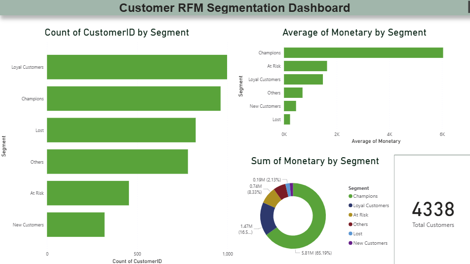

# Customer Segmentation with RFM Analysis

Segmenting ~4,300 customers of a UK online retailer using RFM (Recency, Frequency, Monetary) analysis to identify high-value customers, at-risk customers, and growth opportunities.

## Dashboard Preview


## Business Question
Which customers are most valuable, and which are at risk of churning? How should marketing efforts be prioritized across customer groups?

## Dataset
[UCI Online Retail Dataset](https://archive.ics.uci.edu/dataset/352/online+retail) — ~540K transactions (Dec 2010–Dec 2011) from a UK-based online retailer.

## Tools
Python (pandas, matplotlib, seaborn) · Power BI · SQL logic via pandas groupby

## Methodology
1. Cleaned data (removed missing CustomerIDs, negative quantities/prices) → 397,884 valid transactions
2. Calculated RFM metrics per customer: Recency, Frequency, Monetary
3. Scored each metric 1–5 using quantiles, combined into an RFM score
4. Classified customers into 6 segments: Champions, Loyal Customers, New Customers, At Risk, Lost, Others
5. Built an interactive Power BI dashboard to visualize segment size and value

## Key Findings
| Segment | Customers | Insight |
|---|---|---|
| Loyal Customers | 998 | Largest group — consistent repeat buyers |
| Champions | 962 | Top spenders & most active — drive ~65% of total revenue |
| Lost | 824 | Long inactive — win-back campaign candidates |
| Others | 781 | Mixed behavior |
| At Risk | 454 | Was valuable, now inactive — urgent re-engagement needed |
| New Customers | 319 | Recently acquired — opportunity to build loyalty |

## Recommendations
- **Champions:** loyalty rewards, early access to new products
- **At Risk:** targeted discounts before they become "Lost"
- **Lost:** win-back campaigns with strong incentives
- **New Customers:** onboarding offers to boost repeat purchases

## Repository Structure
```
├── rfm_customer_segmentation.ipynb   # Analysis notebook
├── Online Retail.xlsx                # Raw dataset
├── RFM_Customer_Dashboard.pbix       # Power BI dashboard
├── visuals/                          # Chart & dashboard images
└── README.md
```

## Source
Chen, D. (2015). Online Retail [Dataset]. UCI Machine Learning Repository. https://doi.org/10.24432/C5BW33
